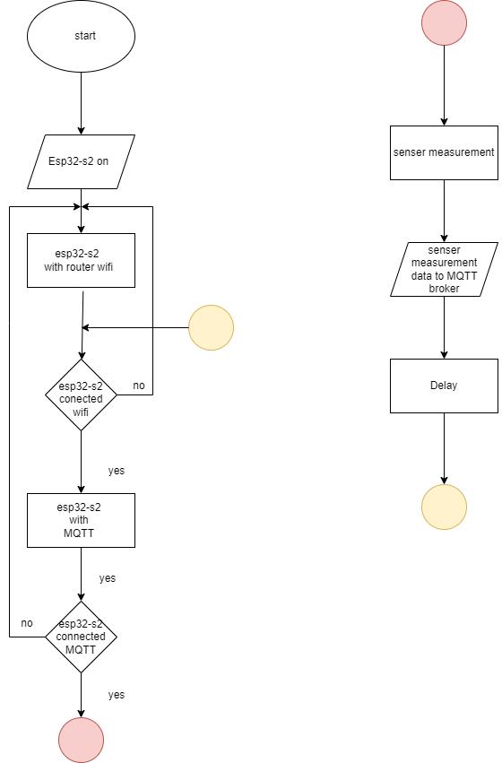

# Ingest and store real-time data from IoT sensors.

## MQTT Topic
MQTT Topic = "iot-frames"

## MQTT Payload
```bash
   /// json output
  StaticJsonDocument<512> jsonDoc;
  jsonDoc["id"] = "43245253";
  jsonDoc["name"] = "iot_sensor_3";
  jsonDoc["place_id"] = "42343243";
  jsonDoc["date"] = NTP.getTimeDateString(time(NULL), "%Y-%m-%dT%H:%M:%S"); // ISO 8601 format
  jsonDoc["timestamp"] = epochTime;

  JsonObject payload = jsonDoc.createNestedObject("payload");
  payload["temperature"] = temp;
  payload["humidity"] = humid;
  payload["pressure"] = pressure/100;
  payload["luminosity"] = analogval;
```
#Set Up Board Cucumber RS

ดาวน์โหลดและติดตั้ง Arduino IDE
ติดตั้ง Arduino Core for ESP32 โดยเปิดเมนู File > Preferences แล้วกรอก URL ลงในช่อง Additional Board Manager URLs https://raw.githubusercontent.com/espressif/arduino-esp32/gh-pages/package_esp32_index.json
ติดตั้ง ESP32 โดยเลือกเมนู Tools > Board > Boards Manager จากนั้นค้น esp32 แล้วติดตั้ง
ติดตั้งไดรเวอร์ FTDI แล้วเสียบบอร์ด Cucumber RS กับคอมพิวเตอร์

#Senseor ภายใน board

BMP280 : วัดความดันอากาศ
MPU6050 : ตรวจจับการเคลื่อนไหว
HTS221 : วัดอุณหภูมิและความชื้น
LDR : วัดระดับแสง

#Send data to kafka

include library สำหรับเชื่อมต่อกับ MQTT broker และ ส่งข้อมูลเซ็นเซอร์ในรูปแบบ JSON (PubSubClient.h, ArduinoJson.h, WiFi.h)
เชื่อมต่อกับ WiFi ของเราโดยสร้าง function setupWifi()
เชื่อมต่อกับ MQTT broker โดยผ่าน function reconnect()
สร้าง JSON จากข้อมูลเซ็นเซอร์ HTS221, BMP280, MPU6050
ส่ง JSON ไปยัง topic ของเรา

#ตั้งค่าสี แสดงสถานะ

ภายใน Board Cucumber ที่ GPIO_18 จะติดตั้ง RGB LED WS2812B ซึ่งเราจะใช่ในการแสดงสี เพื่อบอกสถานนะการทำงานของ board โดยใช้ Adafruit_NeoPixel ในการควบคุมการเปลี่ยนส
สีแดง: แสดงสถานะเริ่มต้นการทำงานของ board
สีเขียว: แสดงสถานะเชื่อมต่อ Wifi สำเร็จ
สีสีฟ้า: แสดงสถานะเชื่อมต่อ MQTT สำเร็จ
สีฟ้า(กะพริบ) :แสดงว่า board ของเรากำลังส่งข้อมูลออก
สีแดง :แสดงสถานะว่ามี error เกิดขึ้นเช่น เชื่อม MQTT ไม่สำเร็จ
สีเเดง(กะพริบ) :แสดงสถานะว่าเชื่อมต่อ WiFi ไม่สำเร็จ

#แสดงเวลา

จะใช้ NTP (Network Time Protocol) เพื่อซิงโครไนซ์เวลาที่ถูกต้องจากเซิร์ฟเวอร์ NTP และใช้เวลานี้ในการประทับเวลา (timestamp) บนข้อมูลที่ส่งผ่าน MQTT ไปยัง Kafka
โดยใช้ไลบรารี ESPNtpClient ซึ่งช่วยให้การตั้งค่าและรับเวลา NTP จากเซิร์ฟเวอร์ (ใช้เซิร์ฟเวอร์ NTP ของเราเอง "172.16.46.88")
เวลาและวันที่ที่ได้รับจากเซิร์ฟเวอร์ NTP จะถูกบันทึกลงใน JSON payload ซึ่งจะใช้เป็น timestamp ของข้อมูลเซ็นเซอร์

## ESP32
```cpp
/// LIB
#include <Wire.h>
#include <Adafruit_BMP280.h>
#include <Adafruit_MPU6050.h>
#include <SensirionI2cSht4x.h>
#include <Adafruit_NeoPixel.h>
#include <ESPNtpClient.h>
#include <PubSubClient.h>
#include <ArduinoJson.h>
#include <WiFiUdp.h>
#include <WiFi.h>
#include <SPI.h>

/// Set up WiFi config
const char* ssid = "TP-Link_CA30";
const char* password = "29451760";
const char* mqtt_server = "172.16.46.88";
const int mqtt_port = 1883;

// NeoPixel settings
#define LED_PIN    18
#define LED_COUNT  1
Adafruit_NeoPixel strip(LED_COUNT, LED_PIN, NEO_GRB + NEO_KHZ800);

/// For user pass
const char* mqtt_user = "iot-may3";
const char* mqtt_password = "1234";

/// Net
const PROGMEM char* ntpServer = "172.16.46.88";

/// Sensor Config
// BMP280
Adafruit_BMP280 bmp280;

//DHT 11
SensirionI2cSht4x sensor;

//Light
int sensorPin = 5;
int analogValue = 1;

/// const for error handle 
static char errorMessage[64];
static int16_t error;
#define NO_ERROR 0

/// Network config setup
WiFiClient espClient;
PubSubClient client(espClient);
WiFiServer server(1883);
IPAddress local_IP(172, 16, 46, 89);   // Static IP address
IPAddress gateway(172, 16, 46, 254);      // IP address of your router
IPAddress subnet(255, 255, 255, 0);

/// WiFi void setup()
void setup_wifi() {
  delay(10);
  Serial.println();
  Serial.print("Connecting to ");
  Serial.println(ssid);

  WiFi.begin(ssid, password);

  /// Wait until connect
  while (WiFi.status() != WL_CONNECTED) {
    // กระพริบไฟสีแดงเมื่อยังเชื่อมต่อ Wi-Fi ไม่ได้
    strip.setPixelColor(0, strip.Color(255, 0, 0)); // สีแดง
    strip.show();
    delay(500); // รอ 500 มิลลิวินาที

    // ปิดไฟ (สีดำ)
    strip.setPixelColor(0, strip.Color(0, 0, 0)); // สีดำ (ปิด)
    strip.show();
    delay(500); // รอ 500 มิลลิวินาที

    Serial.print("_");
  }

  // เมื่อเชื่อมต่อสำเร็จ เปลี่ยนเป็นไฟสีเขียว
  strip.setPixelColor(0, strip.Color(0 ,255, 0)); // สีเขียว
  strip.show();

  // Report
  Serial.println(" ");
  Serial.println("Success to connect with WiFi!");
  Serial.println("IP address: ");
  Serial.println(WiFi.localIP());
}

///MQTT Connection Error handle
void mqtt_handle() {
  //wait for mqtt
  while (!client.connected()) {
    Serial.print("Connecting with MQTT...");
    strip.setPixelColor(0, strip.Color(0, 0, 255)); // สีเขียว
    strip.show();

    if (client.connect("ESP32Client20", mqtt_user, mqtt_password)) {
      Serial.println("Already connected");
      client.subscribe("esp32/sensorData");

      // เมื่อเชื่อมต่อ MQTT สำเร็จ เปลี่ยนเป็นไฟสีเขียว
      
    } else {
      Serial.print("Fails to connect with MQTT");
      Serial.print("Client State: ");
      Serial.println(client.state());
      Serial.println("Try in 10 sec");
      delay(500);

      // ปิดไฟ (สีดำ)
    strip.setPixelColor(0, strip.Color(0, 0, 0)); // สีดำ (ปิด)
    strip.show();
    delay(500); // รอ 500 มิลลิวินาที

    Serial.print("_");
    }
  }
}

///Sensor Init
void init_BMP280() {
  if (!bmp280.begin(0x76)) {
    Serial.println(F("BMP280 Down"));
    while (1) delay(10);
  }

  bmp280.setSampling(Adafruit_BMP280::MODE_NORMAL,
                     Adafruit_BMP280::SAMPLING_X2,
                     Adafruit_BMP280::SAMPLING_X16,
                     Adafruit_BMP280::FILTER_X16,
                     Adafruit_BMP280::STANDBY_MS_500);
  Serial.println("BMP280 ready");
}

void init_SHT4x() {
  sensor.begin(Wire, SHT40_I2C_ADDR_44);
  sensor.softReset();
  delay(10);
  uint32_t serialNumber = 0;
  error = sensor.serialNumber(serialNumber);
  checkError(error, "Error to call serialNumber()");
  Serial.print("serialNumber: ");
  Serial.println(serialNumber);
}

/// Handle Error
void checkError(int16_t error, const char* errorMsg) {
  if (error != NO_ERROR) {
    Serial.print(errorMsg);
    errorToString(error, errorMessage, sizeof errorMessage);
    Serial.println(errorMessage);
  }
}

void init_NTP() {
  NTP.setTimeZone(TZ_Asia_Bangkok);
  NTP.setInterval(600);
  NTP.setNTPTimeout(5000);
  NTP.begin(ntpServer);
}

// Setup 
void setup() {
  Wire.begin(41, 40);
  Serial.begin(115200);

  // NeoPixel setup
  strip.begin();
  strip.setBrightness(RGB_BRIGHTNESS);
  strip.show(); // Initialize all pixels to 'off'

  /// Network
  setup_wifi();
  client.setServer(mqtt_server, mqtt_port);
  WiFi.begin(ssid, password);
  while (WiFi.status() != WL_CONNECTED) {
    delay(500);
    Serial.print(".");
  }
  server.begin();

  //// Check if wifi fail
  if (!WiFi.config(local_IP, gateway, subnet)) {
    Serial.println("Wifi Failed to configure");
  }

  /// init sensor
  init_BMP280();
  init_SHT4x();

  // NTP
  init_NTP();
}

///Setup Time
unsigned long Get_EpochTime() {
    time_t now;
    struct tm timeinfo;
    if (!getLocalTime(&timeinfo)) {
      return 0;
    }
    time(&now);
    return now;
}

/// Main void loop()
void loop() {
  if (!client.connected()) {
    mqtt_handle();
  }
  client.loop();

  // ปิดไฟ (สีดำ)
  strip.setPixelColor(0, strip.Color(0, 0, 0)); // สีดำ (ปิด)
  strip.show();
  delay(500); // รอ 500 มิลลิวินาที

  /// Data assign 
  float temp = bmp280.readTemperature();
  float pressure = bmp280.readPressure();
  float aTemperature = 0.0;
  float humid = 0.0;
  error = sensor.measureLowestPrecision(temp, humid);
  checkError(error, "Error to call STHX4");
  int analogval = analogRead(sensorPin);
  unsigned long epochTime = Get_EpochTime();

  Serial.println(temp);
  Serial.println(pressure);
  Serial.println(humid);
  Serial.println(analogval);
  
  /// json output
  StaticJsonDocument<512> jsonDoc;
  jsonDoc["id"] = "43245253";
  jsonDoc["name"] = "iot_sensor_3";
  jsonDoc["place_id"] = "42343243";
  jsonDoc["date"] = NTP.getTimeDateString(time(NULL), "%Y-%m-%dT%H:%M:%S"); // ISO 8601 format
  jsonDoc["timestamp"] = epochTime;

  JsonObject payload = jsonDoc.createNestedObject("payload");
  payload["temperature"] = temp;
  payload["humidity"] = humid;
  payload["pressure"] = pressure/100;
  payload["luminosity"] = analogval;

  char jsonData[512];
  serializeJson(jsonDoc, jsonData);

  // Export MQTT data
  client.publish("iot-frames", jsonData);

  Serial.print("Time:");
  Serial.print(NTP.getTimeDateString(time(NULL), "%Y-%m-%dT%H:%M:%S"));
  Serial.println("");
  strip.setPixelColor(0, strip.Color(255, 0, 255)); // สีน้ำเงิน
  strip.show();
  delay(500);
}
```


# flowchart
