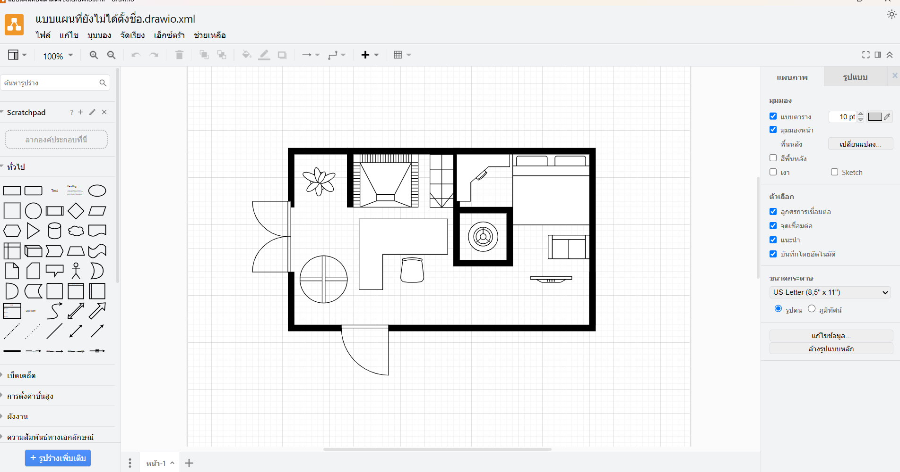

# Data Visualization.

>> นำข้อมูลอะไรมาแสดงในส่วนของ Visualization บ้าง

เราสร้างDashboard ที่รับค่ามาจากserver ที่เพื่อนทำ และเราใช้Grafana และต้องติดตั้งplugin   คือFlowchartin มันออกแแบบและสร้างแผนผังการทำงานมันทำให้สวยงาน และสามารถรับค่ามาจากDrawio ที่เราจะสร้างเป็นรูปห้อง

เราต้องงติดตั้งFlowcharting ให้เป็นversion 1.0.0
อย่างแรกที่ทำคือการไปclone ของ Grafana-flowcharting  ของskyflank 
กดเข้า  grafana และเข้าไปที่Adminstration เพื่อเข้าไปที่Plugin 
 
1. cd เพื่อเข้าไปที่plugin
 cd/var/lib/grafana/plugin

2. สร้างdirectory เก็บPlugin file ที่เราจะcdเข้าไป

 mkdir src
 cd src
 คลิ๊ก ขวา copy link ที่ปเ็นสีแอดง   ของ agenty-flowcharting-panel-1.0.0e.231214594-SNAPSHOT.zip

3. โหลดplugingที่บอกไปตอนแรกที่ไปcloneของskyflankมา
https://github.com/skyfrank/grafana-flowcharting/releases/tag/v1.0.0e

sudo apt-get update
sudo apt-get install wget

แล้วเราก็มา unzip file
unzip agenty-flowcharting-panel-1.0.0e.231214594-SNAPSHOT.zip

sudo mv dist../grafana-flowcharting-panel

ทำให้grafana   เป็น  versionใหม่แบบที่อาจารย์บอก แล้วก็เข้า
docker compose restart grafana

docker compose restart grafana

#######เปิดgrafana ในbrowser เพื่อตรวจสอบว่ามี plugin ชื่อ FlowCharting ติดตั้งแล้วหรือยัง ถ้ามีแสดงว่าติดตั้งสำเร็จแล้ว

แก้ไขในหน้า docker-compose.yml

GF_SECURITY_ANGULAR_SUPPORT_ENABLED=True
GF_FEATURE_TOGGLES_ANGULARDEPRECATIONUI=False

grafana:
    image: grafana/grafana:latest-ubuntu
    container_name: grafana
    user: '0'
    volumes:
      - ./grafana/data:/var/lib/grafana
      - ./grafana/dashboards:/etc/grafana/provisioning/dashboards
      - ./grafana/datasources:/etc/grafana/provisioning/datasources
      - ./grafana/data/plugins:/var/lib/grafana/plugins
     
    environment:
      - GF_SECURITY_ADMIN_USER=${ADMIN_USER:-admin}
      - GF_SECURITY_ADMIN_PASSWORD=${ADMIN_PASSWORD:-admin}
      # - GF_INSTALL_PLUGINS=grafana-clock-panel,grafana-worldmap-panel,grafana-piechart-panel
      - GF_USERS_ALLOW_SIGN_UP=false
      - GF_SECURITY_ANGULAR_SUPPORT_ENABLED=True
      - GF_FEATURE_TOGGLES_ANGULARDEPRECATIONUI=False
    restart: unless-stopped
    links:
       - prometheus
    ports:
      - '8085:3000'

##การใช้งาน FlowCharting แบบง่าย ๆ

รูปจากแพลนที่ทำด้วยdraw.io ครั้งแรก

รูปจากแพลนที่ทำด้วยdraw.io ครั้งที่ให้วางเซนเซอร์10ตัว

 1.ออกแบบแผนผังบ้านใน Drawio
 export plan ออกมาเป็ฯ xml เพื่อไปใช้อันต่อไป

เราจะออกแบบแผนผังบ้าน และใส่ sensors 10 ตัวเพื่อวัดอุณหภูมิจากแต่ละจุดมาแสดงที่ Dashboard

ติดตั้ง Plugin FlowCharting
ติดตั้ง plugin FlowCharting แล้วไปที่มุมขวาบน กด Add > เลือก Visualization และค้นหาคำว่า FlowCharting

แก้ไข Diagram บน Dashboard
เมื่อเข้ามาใน FlowCharting ให้เลือก Edit Diagram เพื่อนำแผนผังที่ออกแบบใน Drawio มาแก้ไขบน Dashboard ตามต้องการ เช่น สร้างกล่องโปร่งใส 10 กล่องสำหรับแสดงค่าอุณหภูมิจาก sensors และเพิ่มกล่องข้อความเพื่ออธิบายตำแหน่งของ sensors ได้ด้วย

ดึงค่าอุณหภูมิจาก Sensor ด้วย Prometheus
เลือก Data Source เป็น Prometheus ซึ่งจะใช้ดึงค่าอุณหภูมิแบบ real-time จาก sensors โดยเลือก Metric ที่ต้องการแสดง เช่น sample_sensor_metric_temperature และกำหนด Label เป็น sensor_name เพื่อให้ง่ายต่อการจับคู่กับ sensors บนแผนผัง

เชื่อมต่อค่ากับแผนผัง
ไปที่ Rules แล้วเลือกค่าอุณหภูมิที่ต้องการแสดงในแต่ละกล่องบนแผนผัง จากนั้นใช้ Map Color และ Map Text เพื่อกำหนดสีและข้อความของกล่อง เช่น หากอุณหภูมิต่ำกว่า 30 องศา ให้แสดงเป็นสีฟ้า

ทำซ้ำสำหรับ Sensor อื่น ๆ
ทำการ duplicate กฎที่สร้างไว้ และเปลี่ยนค่าของ sensors ในแต่ละจุดให้ครบทั้ง 10 ตัว โดยการ map ค่าใหม่ใน Drawio

แค่นี้ก็จะได้แผนผังที่แสดงค่าอุณหภูมิจาก sensors ทั้ง 10 ตัวแบบ real-time บน Dashboard แล้ว

>>ข้อมูลเซนเซอร์<<

IoT Sensor AVG Temperature 

กราฟแบบวงกลม (Gauge) แสดงค่าอุณหภูมิเฉลี่ยของเซ็นเซอร์ IoT หลายตัว โดยหน่วยเป็น °C (องศาเซลเซียส) แต่ละเซ็นเซอร์มีการแสดงค่าอุณหภูมิด้วยเข็มและสี

-สีเขียว แสดงถึงอุณหภูมิที่อยู่ในเกณฑ์ปกติ
-สีแดง แสดงถึงอุณหภูมิที่อาจสูงเกินไป หรือมีปัญหา

ตามในรูป:

>iot_sensor_2 มีค่าเฉลี่ยที่ 3.4°C (สีเขียว) ซึ่งหมายถึงอุณหภูมิอยู่ในระดับที่ปลอดภัย
>iot_sensor_7 และ iot_sensor_9 แสดงค่าที่ 27°C (สีแดง) ซึ่งอาจจะสูงเกินไปและจำเป็นต้องตรวจสอบ

ioT Sensor Luminosity

แสดงค่าความสว่างของเซ็นเซอร์ IoT หลายตัว (iot_sensor_1, iot_sensor_2,- iot_sensor_10 ) ในหน่วย kLm (Kilolumens) ซึ่งมีการแบ่งออกเป็นแถบสีเพื่อแสดงระดับของความสว่าง

-สีเขียว แสดงถึงค่าความสว่างที่อยู่ในเกณฑ์ปกติ หรือค่าที่ปลอดภัย
-สีแดง แสดงถึงค่าความสว่างที่อาจจะสูงกว่าปกติ ซึ่งอาจเป็นสัญญาณเตือนถึงปัญหาที่ต้องได้รับการตรวจสอบ

ตามในรูป:

iot_sensor_2 มีค่าความสว่างที่สูงถึง 46.9 kLm (สีแดง) ซึ่งเป็นสัญญาณที่อาจจะต้องตรวจสอบ
iot_sensor_10 มีค่า 6.10 kLm (สีเขียว) ซึ่งอยู่ในระดับปกติ

 >>IoT Sensor Humidity (ความชื้น)
 ส่วนนี้แสดงค่าความชื้นสัมพัทธ์ในหน่วย %H (เปอร์เซ็นต์ของความชื้นสัมพัทธ์) สำหรับเซ็นเซอร์ 3 ตัว (iot_sensor_1, iot_sensor_2, iot_sensor_3)
 
-iot_sensor_1: 48.5%H
-iot_sensor_2: 51.6%H
-iot_sensor_3: 46.0%H

กราฟแนวตั้งสีเขียวที่อยู่ข้างล่างแต่ละค่าแสดงการเปลี่ยนแปลงของค่าความชื้นตลอดช่วงเวลาที่กำหนด ซึ่งสามารถช่วยในการตรวจสอบแนวโน้มของความชื้นในพื้นที่ที่เซ็นเซอร์แต่ละตัววัดได้

>> IoT Sensor Pressure (ความดัน)

แสดงค่าความดันในหน่วย bar สำหรับเซ็นเซอร์ 3 ตัว:

iot_sensor_1: 1.014 bar
iot_sensor_2: 1.014 bar
iot_sensor_3: 1.020 bar (สีแดง)
ค่าความดันของเซ็นเซอร์ที่สาม (iot_sensor_3) อยู่ในโซนสีแดง แสดงว่าความดันอาจจะสูงเกินกว่าที่ควรจะเป็น และจำเป็นต้องได้รับการตรวจสอบหรือตรวจวัดซ้ำตามรูป

  กราฟใน Dashboard นี้มีหน้าที่ในการแสดงข้อมูลสำคัญจากเซ็นเซอร์หลายตัว เพื่อให้สามารถตรวจสอบสถานะและสภาพแวดล้อมได้อย่างละเอียด เช่น ความชื้น อุณหภูมิ, ความสว่าง และความดัน ทั้งนี้หากมีค่าที่ผิดปกติ (สีแดง) ผู้ใช้งานจะได้รับการแจ้งเตือนเพื่อให้ดำเนินการตรวจสอบปัญหาและแก้ไขได้ทัน
